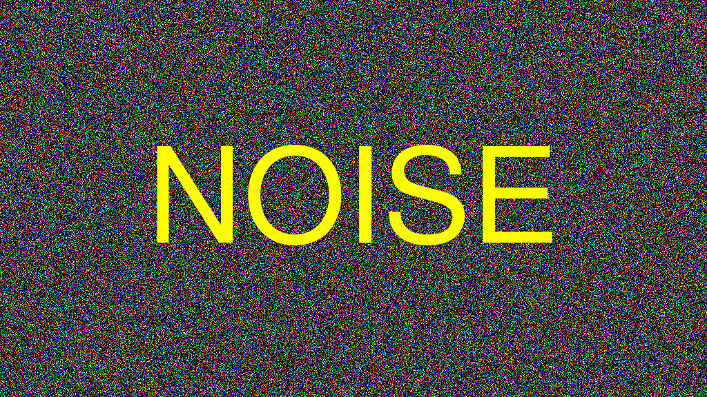

# Brite Bartnek's Portfolio

This is my home page! My name is Brite Bartnek and I am a student at [Cal State Fullerton](http://www.fullerton.edu/) and my major is Computer Science.

## Computer Science Projects

My GitHub page is http://github.com/RunningOffCaffeine.

### CPSC 120

* Lab 7, Part 2

    Lab 7, part 2 was a favorite because I personaly love the game Blackjack. I was able to write functions for the first time
    that calculate the correct value of a Blackjack hand no matter how many
    Aces were dealt. I truly enjoyed creating the proper checks to not mess up the Ace values.

* Lab 9, part 2

    Lab 9, part 2 was a favorite because it was fun to learn how to compare strings character by character. Learning new methods for solving problems withcode is always fun for me.

* Lab 12, Part 2

    

    Lab 12, Part 2 was a favorite because it was fun to see how noise can be used to create an image. it was very fun to see the patterns that can for in the noise.
